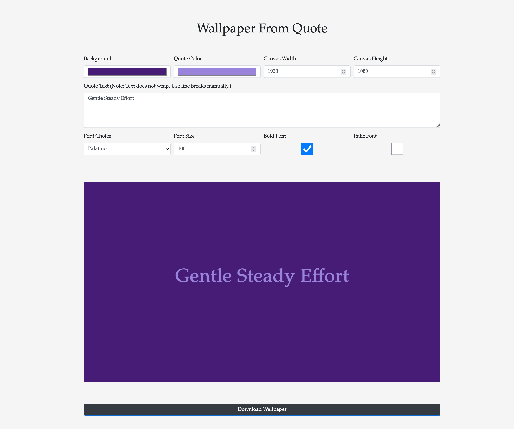

# Wallpaper From Quote

 

This project is a simple, single-page web application that allows users to create custom wallpapers from text quotes. The application is built using HTML, CSS, and JavaScript.

 

## Features

- **Color Selection**: Users can select the background color and the color of the quote text.
- **Canvas Size**: Users can specify the width and height of the wallpaper.
- **Quote Text**: Users can input the quote text. Note that the text does not wrap automatically, so line breaks must be added manually.
- **Font Selection**: Users can choose from a variety of fonts for the quote text.
- **Font Size**: Users can specify the size of the font.
- **Font Style**: Users can choose to make the font bold and/or italic.
- **Wallpaper Preview**: The generated wallpaper is displayed on the page.
- **Wallpaper Download**: Users can download the generated wallpaper as a PNG file.

 

## Preview

Here is a preview of the application:

 

## Usage

To utilize this application, you can either visit [this link](https://steve-shao.github.io/proj-wallpaper-from-quote) or download the entire folder and launch the `index.html` file in your preferred web browser.

  

## Contributing

Contributions are welcome. Please open an issue to discuss your ideas before making changes.

 

## License

This project is licensed under the MIT License. See the `LICENSE` file for details.